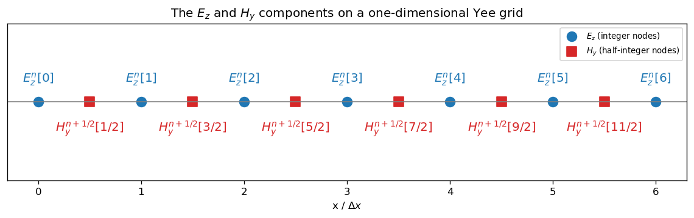

# Discretization of Maxwell's Equations

In the previous chapter, we reduced Maxwell's equations to a one-dimensional system for $E_z$ and $H_y$. We now discretize these equations and obtain expressions that can be applied in the implementation. These expressions comprise the update equations and source injection.

## The Finite-Difference Method and the Yee Grid

We replace a derivative with the ratio of a function's change to a small step, thereby transforming a continuous equation into a set of algebraic expressions that can be evaluated numerically. A central difference uses samples on both sides of the point under consideration and gives a second-order error for a sufficiently smooth function. Reducing the step decreases this error, but simultaneously increases the number of cells and the amount of computation.

$$
\left(\frac{\partial f}{\partial x}\right)_i\approx\frac{f[i + 1/2]-f[i - 1/2]}{\Delta x} \tag{3.1}
$$

In the standard FDTD method, the Yee grid provides the basis for the spatial arrangement of the fields [@yee1966]. By the convention adopted in this work, $E_z$ is placed at integer spatial indices, while $H_y$ is positioned between neighboring electric-field points. The same offset is applied in time, so the magnetic states occur halfway between the electric states. This arrangement allows us to calculate the central difference from neighboring values without additional interpolation.

$$
x_E[k]=k\Delta x,\qquad x_H[k + 1/2]=(k + 1/2)\Delta x \tag{3.2}
$$

$$
t_E[n]=n\Delta t,\qquad t_H[n + 1/2]=(n + 1/2)\Delta t \tag{3.3}
$$

The spatial and temporal arrangement of the components is shown in Figure 3.1. The fields are staggered in space and time, which allows them to be updated alternately. Each new magnetic state uses the known electric state, and each new electric state uses the newly completed magnetic state. This procedure is straightforward to implement and does not require solving a large system of equations.

## Spatial and Temporal Discretization

We divide the spatial domain into $K$ cells of equal width and the time interval into $N$ consecutive steps. The indices $k$ and $n$ replace the continuous coordinates $x$ and $t$, while $\Delta x$ and $\Delta t$ determine the resolution. A physical quantity is represented by an array of samples at discrete points.

$$
x_k=k\Delta x,\qquad t_n=n\Delta t \tag{3.4}
$$

The spatial derivative of $E_z$ uses two neighboring electric-field points and belongs to the magnetic-field point between them. The derivative of $H_y$ uses the magnetic-field points on either side of an electric-field point and therefore corresponds to an integer spatial index. These two expressions also determine the valid loop bounds in the program.

$$
\left(\frac{\partial E_z}{\partial x}\right)_{k+1/2}\approx\frac{E_z^n[k + 1]-E_z^n[k]}{\Delta x} \tag{3.5}
$$

$$
\left(\frac{\partial H_y}{\partial x}\right)_k\approx\frac{H_y^{n+1/2}[k + 1/2]-H_y^{n+1/2}[k - 1/2]}{\Delta x} \tag{3.6}
$$

We also approximate the time derivatives with central finite differences, accounting for the temporal staggering of the components on the Yee grid. For the magnetic field, we use the values at times $n-1/2$ and $n+1/2$, so the approximation belongs to time $n$. For the electric field, we use the values at times $n$ and $n+1$, and the approximation belongs to time $n+1/2$.

$$
\left(\frac{\partial H_y}{\partial t}\right)_{k+1/2}^{n}\approx\frac{H_y^{n+1/2}[k + 1/2]-H_y^{n-1/2}[k + 1/2]}{\Delta t} \tag{3.7}
$$

$$
\left(\frac{\partial E_z}{\partial t}\right)_{k}^{n+1/2}\approx\frac{E_z^{n+1}[k]-E_z^n[k]}{\Delta t} \tag{3.8}
$$

We assign the material properties to the spatial points of the corresponding field components. This aligns their arrangement with the Yee grid, so the permeability and magnetic conductivity are written as $\mu[k + 1/2]$ and $\sigma_m[k + 1/2]$, while the permittivity and electrical conductivity are written as $\varepsilon[k]$ and $\sigma_e[k]$. These quantities have no time index because the material properties do not change during the simulation.

## Discrete System of Equations

Substituting the approximations from the previous section into the symmetric system of Maxwell's equations gives the discrete system of equations. In doing so, we follow the half-step conventions of the Yee grid.

In Faraday's law, we replace the time derivative of $H_y$ and the spatial derivative of $E_z$ with the corresponding central differences. We approximate $H_y$ in the loss term by the arithmetic mean of its states at times $n-1/2$ and $n+1/2$. This gives the discrete magnetic-field equation at the point $k + 1/2$.

$$
\begin{aligned}
\frac{H_y^{n+1/2}[k + 1/2]-H_y^{n-1/2}[k + 1/2]}{\Delta t}
&=\frac{1}{\mu[k + 1/2]}\frac{E_z^n[k + 1]-E_z^n[k]}{\Delta x}\\
\text{ }&\text{ }-\frac{\sigma_m[k + 1/2]}{\mu[k + 1/2]}\frac{H_y^{n+1/2}[k + 1/2]+H_y^{n-1/2}[k + 1/2]}{2}.
\end{aligned} \tag{3.9}
$$

In the modified Ampère law, we similarly replace the time derivative of $E_z$ and the spatial derivative of $H_y$. We approximate $E_z$ in the loss term by the arithmetic mean of its states at times $n$ and $n+1$. The resulting discrete equation belongs to the electric-field point $k$.

$$
\begin{aligned}
\frac{E_z^{n+1}[k]-E_z^n[k]}{\Delta t}
&=\frac{1}{\varepsilon[k]}\frac{H_y^{n+1/2}[k + 1/2]-H_y^{n+1/2}[k - 1/2]}{\Delta x}\\
\text{ }&\text{ }-\frac{\sigma_e[k]}{\varepsilon[k]}\frac{E_z^{n+1}[k]+E_z^n[k]}{2}.
\end{aligned} \tag{3.10}
$$

These two equations form the discrete system for the electric and magnetic fields. Solving the first equation for $H_y^{n+1/2}[k + 1/2]$ and the second for $E_z^{n+1}[k]$ gives the update equations presented in the next section.

## The $E_z$ and $H_y$ Update Equations

We solve the discrete system for the field values at the next time step. For the magnetic field, this value is $H_y^{n+1/2}[k + 1/2]$, and for the electric field it is $E_z^{n+1}[k]$. In this way, we obtain explicit update equations that are used directly in the sequential simulation algorithm implemented in Chapter 5.

We solve the discrete form of the modified Faraday law for $H_y^{n+1/2}[k + 1/2]$ to obtain the magnetic-field update equation. The coefficient $C_{h1}$ multiplies the magnetic-field value from the previous step, while $C_{h2}$ multiplies the electric-field difference around the magnetic-field point $k + 1/2$.

$$
H_y^{n+1/2}[k + 1/2]=C_{h1}[k + 1/2]H_y^{n-1/2}[k + 1/2]+C_{h2}[k + 1/2]\left(E_z^n[k + 1]-E_z^n[k]\right) \tag{3.11}
$$

Similarly, we solve the discrete form of the modified Ampère law for $E_z^{n+1}[k]$ to obtain the electric-field update equation. The coefficient $C_{e1}$ multiplies the electric-field value from the previous step, while $C_{e2}$ multiplies the magnetic-field difference on either side of the electric-field point $k$.

$$
E_z^{n+1}[k]=C_{e1}[k]E_z^n[k]+C_{e2}[k]\left(H_y^{n+1/2}[k + 1/2]-H_y^{n+1/2}[k - 1/2]\right) \tag{3.12}
$$

The coefficients $C_{h1}$, $C_{h2}$, $C_{e1}$, and $C_{e2}$ depend on the material parameters, conductivities, and the selected steps $\Delta x$ and $\Delta t$, but not on the field values or the time index $n$. Their form and spatial dependence are examined in greater detail in the next section.

## Update Coefficients and Material Modeling

In the previous section, we derived the update equations with electric and magnetic update coefficients. To write these coefficients more concisely, we introduce the dimensionless quantities $a$ and $b$. The quantity $a$ describes electric losses, while $b$ describes magnetic losses; both are zero in a lossless region.

$$
a[k]=\frac{\sigma_e[k]\Delta t}{2\varepsilon[k]},\qquad b[k + 1/2]=\frac{\sigma_m[k + 1/2]\Delta t}{2\mu[k + 1/2]} \tag{3.13}
$$

The coefficients $C_{e1}$ and $C_{e2}$ belong to the electric-field points and contain the material quantities and grid steps. We calculate them before the time loop, eliminating division within the loop. Whenever a material parameter changes, these arrays are recalculated.

$$
C_{e1}[k]=\frac{1-a[k]}{1+a[k]} \tag{3.14}
$$

$$
C_{e2}[k]=\frac{1}{\varepsilon[k]\left(1+a[k]\right)}\frac{\Delta t}{\Delta x} \tag{3.15}
$$

The coefficients $C_{h1}$ and $C_{h2}$ have a symmetric form and belong to the magnetic-field points. After they have been prepared, the computational kernel uses only multiplication, addition, and subtraction on consecutive array elements. The same equations apply to an ordinary material, a conductive region, and the PML layer.

$$
C_{h1}[k + 1/2]=\frac{1-b[k + 1/2]}{1+b[k + 1/2]} \tag{3.16}
$$

$$
C_{h2}[k + 1/2]=\frac{1}{\mu[k + 1/2]\left(1+b[k + 1/2]\right)}\frac{\Delta t}{\Delta x} \tag{3.17}
$$

## Excitation Pulse and Source Injection

A simulation with zero initial fields remains in that state until a source injects energy into the grid. A Gaussian pulse has a short effective duration and contains a broad range of frequencies, making it suitable for examining the transient response. The parameter $n_0$ specifies the time of the maximum, while $w$ determines the temporal width of the pulse.

$$
s_g[n]=\exp\left(-\frac12\left(\frac{n_0-n}{w}\right)^2\right) \tag{3.18}
$$

A sinusoidal source is suitable for examining the steady-state response at a single selected frequency. Its behavior is determined by the amplitude $A$, frequency $f$, and initial phase $\varphi$. The program allows multiple Gaussian and sinusoidal sources to be registered in the same simulation.

$$
s_s[n]=A\sin(2\pi fn+\varphi) \tag{3.19}
$$

The implementation uses soft source injection after updating $E_z$: the calculated value is not replaced, but the excitation is added to it. This procedure causes less disturbance to a wave that subsequently passes back through the source cell. The linearity of the model allows the contributions of multiple sources to be applied in sequence.

$$
E_z^{n+1}[k_c]\leftarrow E_z^{n+1}[k_c]+s[n] \tag{3.20}
$$

## The Courant Condition and Time-Step Organization

The numerical stability of the FDTD method is determined by the dimensionless Courant number [@sullivan2013], [@taflove2005]. The Courant number $S$ relates the maximum wave propagation velocity $c_0$ to the ratio of the time step $\Delta t$ to the spatial step $\Delta x$.

In the one-dimensional model, the Courant number must not exceed one, while the implementation uses the conservative value $S=0.5$ by default. The time-step value follows directly from the selected Courant number and spatial step.

$$
S=\frac{c_0\Delta t}{\Delta x}\leq1 \tag{3.21}
$$

$$
\Delta t=\frac{S\Delta x}{c} \tag{3.22}
$$

We divide one time step into three phases: first we update $H_y$, then $E_z$, and finally apply all sources. After applying the sources, we increment the time counter by one and use the complete new state in the next step. The boundary between the first and second phases must remain explicit in the parallel version as well.
