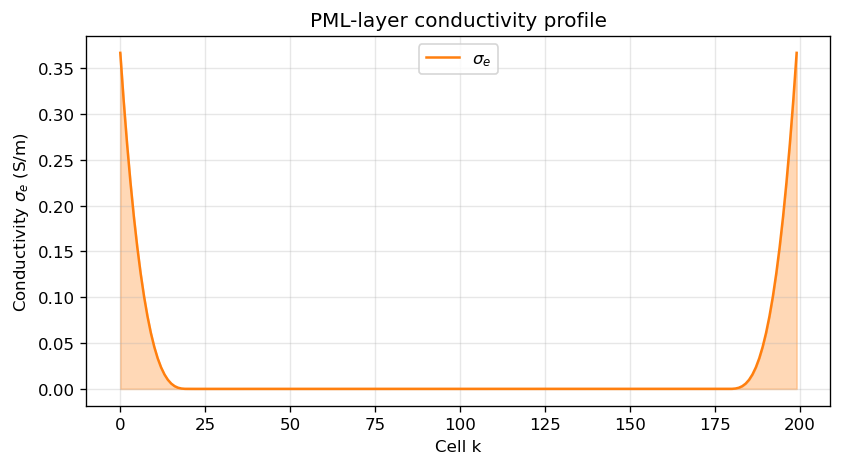

# The Perfectly Matched Layer

In the previous chapter, we derived the update equations for the electric and magnetic fields, but unwanted wave reflection may occur at the ends of the grid. To prevent this reflection, we place Bérenger's perfectly matched layer (PML) at each end of the grid to absorb the incident wave.

## The Need for Absorbing Boundary Conditions

A numerical grid has a finite number of cells, even though the physical problem often represents a space with no apparent boundary. A simple grid termination behaves as a perfect electric conductor (PEC), from which the incident wave is reflected back into the simulation region. The reflected component then combines with the original wave and corrupts the useful result.

An absorbing boundary condition (ABC) reduces the wave energy before it reaches the end of the grid. One such boundary condition is Bérenger's PML [@berenger1994], which represents a lossy region matched to the adjacent medium. In the one-dimensional model, we place this region at the left and right ends of the domain.

Practical absorption is not completely perfect because of finite spatial and temporal discretization. Its quality depends on the number of cells, the conductivity profile, and the shortest wavelength in the signal. The layer parameters must therefore provide gradual attenuation before the wave reaches the final grid point.

## The Basic Principle of the PML Method

Bérenger's PML is an absorbing layer that surrounds the physical simulation region with an artificial lossy material whose impedance is matched to that of the interior medium. The matched impedance reduces reflection at the interface, while the increasing losses attenuate the wave as it passes through the layer.

We set the conductivity to zero at the interface with the interior region and then increase it gradually toward the outer edge of the domain, as shown in Figure 4.1. The wave therefore does not encounter an abrupt change in the first PML cell; instead, its amplitude decreases as it passes through multiple cells. Only a small fraction of the initial energy reaches the outer edge.

The left and right layers use the same profile in opposite directions. The central part of the grid remains free of additional conductivity and represents the physical simulation region. Increasing the PML thickness reduces the physical region but improves the effectiveness of wave absorption.

## The Matching Condition

We select the PML parameters so that its wave impedance matches the impedance of the adjacent medium. Unequal attenuation of the electric and magnetic fields changes their ratio and creates an impedance discontinuity. Such a discontinuity would cause partial wave reflection at the interface between the physical region and the absorbing layer [@berenger1994].

In the symmetric system given by equations (2.16) and (2.17), the electrical conductivity $\sigma_e$ determines the attenuation of the electric field, while the magnetic conductivity $\sigma_m$ determines the attenuation of the magnetic field. Their effects also depend on the permittivity $\varepsilon$ and permeability $\mu$, respectively, so the matching condition is

$$
\frac{\sigma_m}{\mu}=\frac{\sigma_e}{\varepsilon} \tag{4.1}
$$

This condition provides equal relative attenuation of both field components and prevents their ratio from changing as the wave enters the layer. Consequently, no reflection occurs at the interface in the continuous model, while the wave energy is gradually absorbed within the PML. A small reflection remains in the discrete model, but it is further reduced by a gradual conductivity profile and correct sampling on the Yee grid.

## PML Parameters and Coefficients

The physical PML thickness $d$ equals the product of the number of PML cells $N_\text{PML}$ and the spatial step $\Delta x$. The maximum electrical conductivity $\sigma_\text{max}$ depends on this thickness, the target reflection coefficient $R_0$, and the local wave impedance $\eta$ from equation (2.11). A thicker layer permits a slower increase in conductivity for the same final attenuation.

In the standard PML implementation, the target reflection coefficient is $R_0=10^{-6}$ and the polynomial grading order is $m=3$ [@berenger1994]. The cubic profile provides a smooth transition into the layer and considerably stronger attenuation near the outer edge.

$$
d=N_{\text{PML}}\Delta x \tag{4.2}
$$

$$
\sigma_{\max}=-\frac{(m+1)\ln R_0}{2\eta d} \tag{4.3}
$$

We define the electrical conductivity $\sigma_e$ using a polynomial profile and obtain the magnetic conductivity $\sigma_m$ from the matching condition. The electric and magnetic depths are sampled at positions offset by half a cell. The normalized depth $q$ is zero in the interior and approaches one at the outer edge.

$$
\sigma_e(x)=\sigma_{\max}q(x)^m \tag{4.4}
$$

$$
\sigma_m(x)=\sigma_e(x)\frac{\mu(x)}{\varepsilon(x)} \tag{4.5}
$$

These parameters are fixed in the current implementation, while the user selects only the number of PML cells through the public interface. Fixed values simplify usage and enable comparable simulation experiments, while a different profile can be introduced later without changing the computational kernel.

The absorbing PML affects only the conductivities $\sigma_e$ and $\sigma_m$, which are treated as part of the simulation material. These conductivities affect the loss coefficients $a$ and $b$, which in turn affect the update coefficients $C_{h1}$, $C_{h2}$, $C_{e1}$, and $C_{e2}$. The structure of the finite-difference method remains unchanged, and the update equations remain the same.
