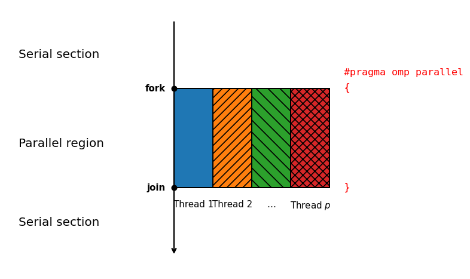

# Parallelization with OpenMP

In the preceding chapter, we described the structure of the serial implementation. This chapter analyzes which parts of the algorithm can be executed in parallel using OpenMP.

## Parallel Execution Model

Modern processors have multiple cores, but a serial program uses only one of them at a time. OpenMP makes it possible to distribute the iterations of a regular loop among threads that share the same address space [@openmp2021]. This approach is well suited to the FDTD algorithm because all threads require the same field and coefficient arrays.

When the program enters an `omp parallel` region, the initial thread creates a team of worker threads. The region encloses the entire sequence of time steps, so the same team remains active until the parallel kernel call finishes. This avoids repeatedly creating and destroying the team for every spatial loop or time step.

This organization is illustrated in Figure 6.1 as the OpenMP fork-join model. The initial thread creates the team once upon entering the parallel region, the threads then process their assigned spatial blocks throughout all time steps, and the team joins only after the parallel kernel has finished.

Within the active region, the `omp for` directive distributes the iterations of the spatial loops, while `omp single` assigns source application and advancement of the time counter to one thread. The compiler and runtime library manage work distribution and synchronization. The numerical expressions remain identical to those in the serial version.

The `schedule(static)` clause instructs the scheduler to divide the iterations into approximately equal, fixed blocks and assign them to the threads. This distribution is appropriate for the FDTD algorithm because each iteration of a spatial loop requires approximately the same amount of work.



## Dependency Analysis and Work Distribution

Parallelization is correct only if different threads do not write to the same destination without an established ordering. In the $H_y$ loop, iteration $k$ reads $E_z^n[k]$, $E_z^n[k + 1]$, and the old $H_y^{n-1/2}[k + 1/2]$, while writing only the new $H_y^{n+1/2}[k + 1/2]$. Because the destinations are distinct, all iterations of this loop can execute independently.

$$
\text{Read}_H[k]=\{E_z^n[k],E_z^n[k + 1],H_y^{n-1/2}[k + 1/2]\}
\tag{6.1}
$$

$$
\text{Write}_H[k]=\{H_y^{n+1/2}[k + 1/2]\}
\tag{6.2}
$$

The $E_z$ loop has the same property: each iteration reads two neighboring $H_y^{n+1/2}$ elements and writes only $E_z^{n+1}[k]$. Overlapping read sets are not a problem because multiple threads may simultaneously read the same unchanged value. What matters is that the write sets of two different iterations do not overlap.

$$
\text{Read}_E[k]=\{H_y^{n+1/2}[k - 1/2],H_y^{n+1/2}[k + 1/2],E_z^n[k]\}
\tag{6.3}
$$

$$
\text{Write}_E[k]=\{E_z^{n+1}[k]\}
\tag{6.4}
$$

The iterations are independent within each phase, but the magnetic and electric phases are not independent of one another. Every iteration of the second loop must observe the already updated neighboring $H_y$ values. Parallelization therefore partitions space while preserving the temporal ordering of the phases.

## Parallelization of the FDTD Algorithm

In the parallel kernel, a single `omp parallel` region encloses the outer time-step loop. The `default(none)` clause requires the data-sharing attribute of every variable to be specified explicitly. The pointers to the field and coefficient arrays, the grid width, and the number of steps are declared `firstprivate`, while the `sim` object is shared.

```c
#pragma omp parallel \
    default(none) \
    firstprivate(Hy, Ez, Ch1, Ch2, Ce1, Ce2, width, nsteps) \
    shared(sim)
{
    for (size_t n = 0; n < nsteps; n++) {

        // Update Hy
        #pragma omp for schedule(static)
        for (size_t k = 0; k < width - 1; k++) {
            Hy[k] = Ch1[k] * Hy[k]
                  + Ch2[k] * (Ez[k + 1] - Ez[k]);
        }

        // Update Ez
        #pragma omp for schedule(static)
        for (size_t k = 1; k < width; k++) {
            Ez[k] = Ce1[k] * Ez[k]
                  + Ce2[k] * (Hy[k] - Hy[k - 1]);
        }

        // Inject Ez source
        #pragma omp single
        {
            Fdtd_EzSourcesApply(sim->fsim_sources, sim);
            Fdtd_EzStateNextStep(sim->fsim_state);
        }
    }
}
```

The pointer copies received by the threads still refer to the same shared arrays. Both spatial loops use `omp for schedule(static)` because all iterations perform approximately the same number of operations. Each thread is consequently assigned a contiguous block of indices, preserving favorable spatial locality.

The simulation function selects the serial or parallel mode according to the value of `fs_accel`. In parallel mode, one thread processes the sources and time counter in the `omp single` block while the other threads wait for it to finish. The same object can therefore be used for reference and parallel measurements without reconstructing the model.

## Synchronization and Thread Management

By default, an `omp for` directive places a barrier at the end of the distributed loop. The first barrier ensures that all $H_y$ values have been updated before any thread begins calculating $E_z$. The second barrier completes the entire $E_z$ update before one thread applies the source.

$$
H_y^{n+1/2}\;\longrightarrow\;\text{barrier}\;\longrightarrow\;E_z^{n+1}\;\longrightarrow\;\text{barrier}\;\longrightarrow\;\text{source and time}
\tag{6.5}
$$

An `omp single` block also has an implicit barrier at its end. It prevents the threads from starting the next time step before the source has been applied and the time counter incremented. Each step therefore contains three necessary synchronization points, but the parallel region is opened only once for the entire kernel call.

Removing the first barrier with the `nowait` clause would be numerically incorrect because a faster thread could read old values from a slower thread's block. The benchmark program sets the number of threads using `omp_set_num_threads()`, and each measurement executes the same number of time steps. The measured speedups can therefore be compared directly.

## Memory Access Locality

Each spatial loop traverses the arrays in increasing index order, so after one element it soon uses neighboring elements from the same cache line. This spatial locality reduces the number of main-memory accesses compared with a random access pattern. Static scheduling preserves the same favorable pattern for every thread.

The arrays are much larger than the processor registers, and the largest grids cannot fit entirely in cache. At every time step, the fields and coefficients are read and the two fields are written back. Because the kernel performs few arithmetic operations per transferred byte, it can become limited by memory bandwidth.

False sharing occurs when two threads write to different elements that belong to the same cache line. With large static blocks, this effect is confined to their boundaries and represents only a small fraction of the total work. Aligned arrays and sufficiently large blocks further reduce its impact.

## Speedup Limitations

Amdahl's law provides an upper bound on speedup, showing that the serial portion of a program limits overall acceleration regardless of the number of threads [@amdahl1967]. In this implementation, coefficient preparation, application of a small number of sources, and time-step management remain serial. In addition, three synchronization points in every step introduce overhead that is absent from serial execution.

$$
S_p\leq\frac{1}{(1-\alpha)+\frac{\alpha}{p}}
\tag{6.6}
$$

The parameter $\alpha$ denotes the fraction of execution time suitable for parallel execution, while $p$ is the number of threads. On a small grid, the useful work per thread is brief, so the cost of creating the team and repeatedly reaching barriers can eliminate the benefit entirely. As the grid grows, the ratio of useful work to synchronization overhead becomes more favorable.

On large grids, speedup begins to be limited by the shared memory subsystem. Adding threads increases the demand for bandwidth but does not increase the amount of computation performed per item of data. In addition to speedup, we therefore consider parallel efficiency, which indicates how effectively each additional thread is used.

$$
E_p=\frac{S_p}{p}
\tag{6.7}
$$

## Arithmetic Intensity of the FDTD Algorithm

In the one-dimensional FDTD algorithm, each cell update performs a small number of additions and multiplications, but it reads a field value and two coefficients and writes the field back. The ratio of arithmetic work to transferred data is therefore relatively low compared with procedures that reuse the same values in registers. This ratio is known as arithmetic intensity and helps predict when memory bandwidth will become the limiting factor.

$$
I=\frac{F}{Q}
\tag{6.8}
$$

The quantity $F$ denotes the number of arithmetic operations, while $Q$ is the amount of data transferred between the processor and the memory hierarchy. The exact value depends on cache behavior, the write policy, and the `Fdtd_FloatType` type, so it cannot be obtained merely by counting operations in the source code. The loop structure nevertheless shows that every additional thread uses the same shared memory bandwidth. Table 6.1 summarizes the main reads and writes of both kernels.

Table: Data accesses in one iteration

| Kernel | Main reads | Main write |
| --- | --- | --- |
| $H_y$ | old $H_y$, two $E_z$ values, $C_{h1}$ and $C_{h2}$ | new $H_y$ |
| $E_z$ | old $E_z$, two $H_y$ values, $C_{e1}$ and $C_{e2}$ | new $E_z$ |

Good spatial locality allows neighboring reads to share a cache line, but it does not eliminate the need to fetch large arrays from memory. With sufficiently many threads, bandwidth is therefore expected to saturate before the arithmetic units are fully utilized. The measured increase in throughput should be interpreted in light of this limitation.

## Choosing Between Serial and Parallel Execution

Parallel execution is not the best choice in every situation, as the results for small grids later confirm. The library currently leaves it to the user to select `FDTD_ACCEL_NONE` or `FDTD_ACCEL_OPENMP`. This decision is clear and predictable, but it requires the user to understand the size and environment of the problem.

A simple automatic choice could use a grid-width threshold obtained from a short initial measurement. If the parallel version does not reduce execution time over several trial steps, the simulation could continue in serial mode. The threshold should not be permanently tied to a particular number of cells because it depends on the processor, the number of threads, and the state of the system.

Another approach is to let the user select the behavior explicitly while the library merely issues a warning for an obviously small domain. This preserves the reproducibility of scientific measurements and avoids a hidden change in execution mode. Automatic tuning may be more practical for production use, whereas manual control is better suited to experimental work.
