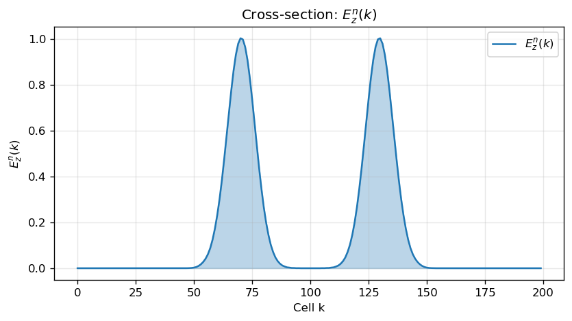
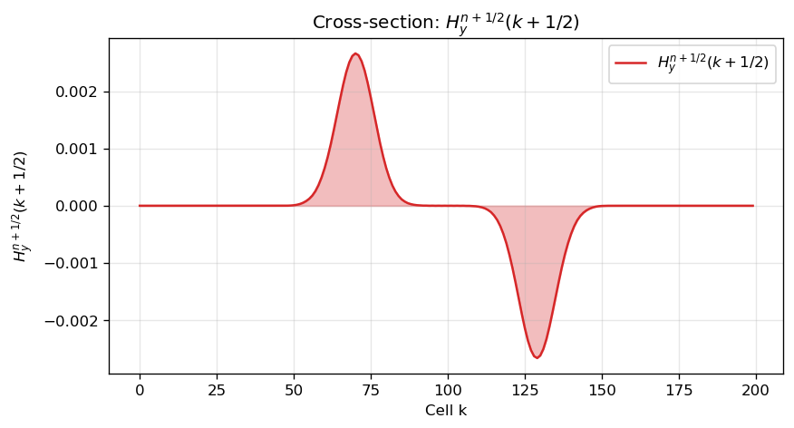
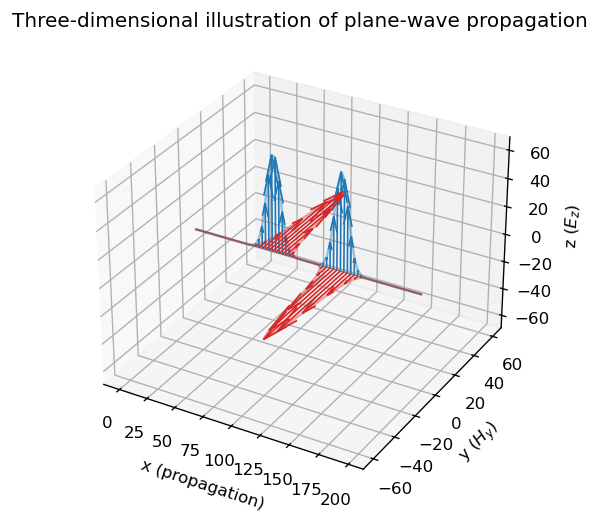
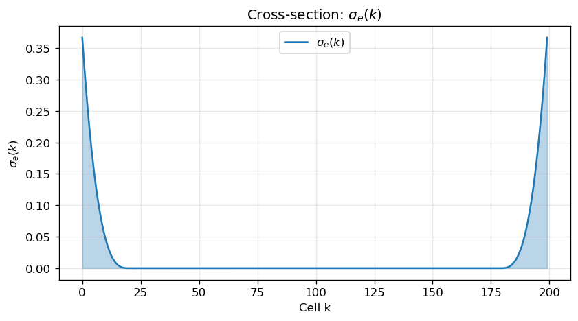
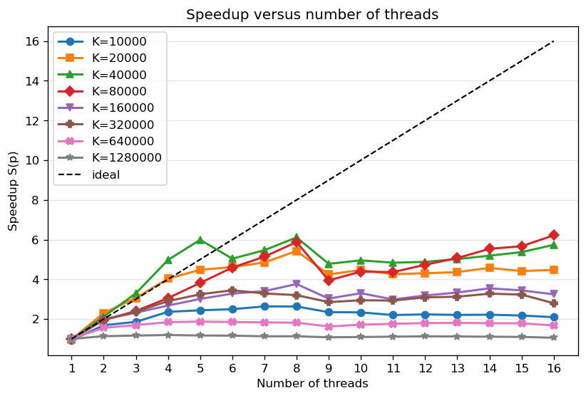
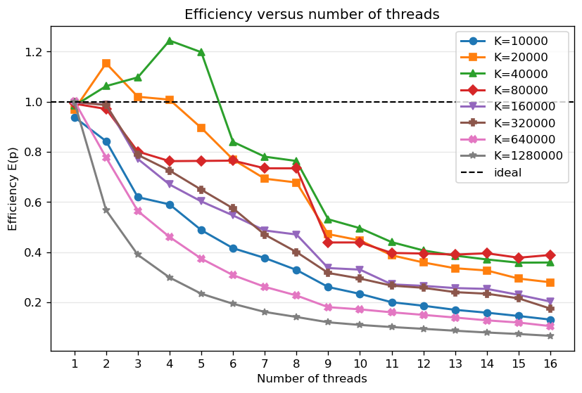
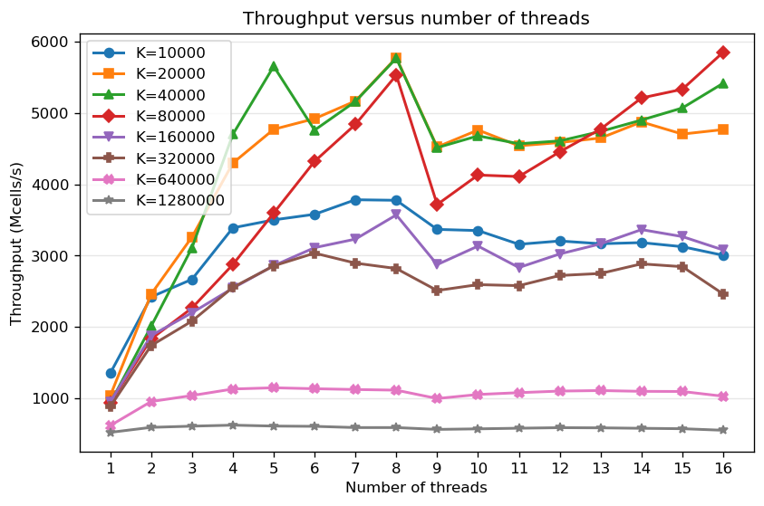
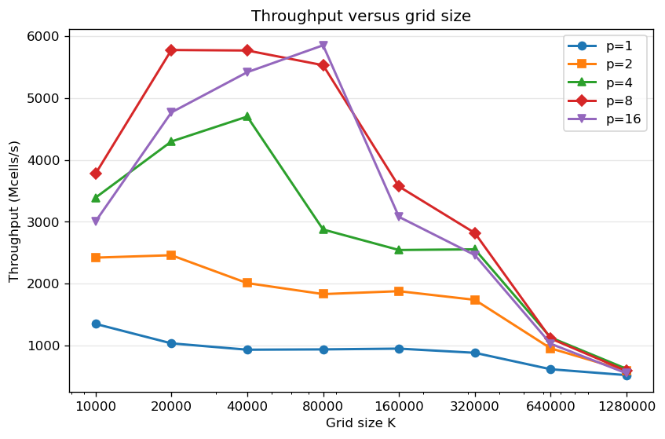
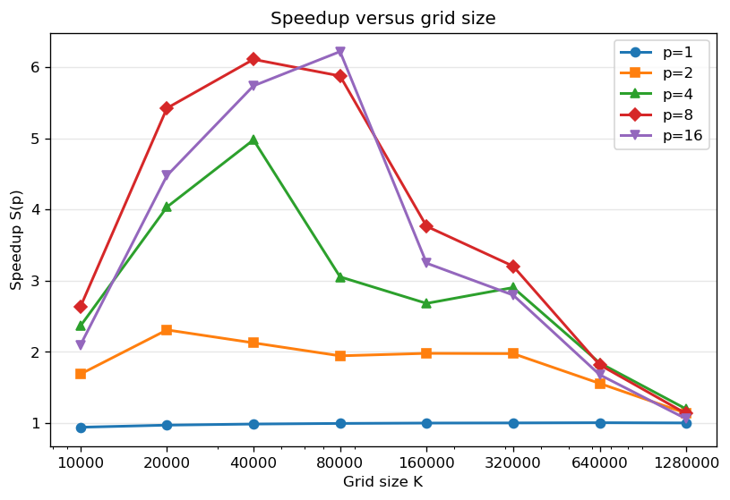

# Results and Analysis

In the preceding chapter, we defined the simulation parameters and measurement procedure. In this chapter, we verify the resulting fields and analyze the performance of the serial and parallel implementations.

## Electromagnetic Wave Propagation

The Gaussian source was placed at the center of the domain, where it creates two waves that propagate in opposite directions. The data after one hundred steps show $E_z$ peaks of approximately 1.002 at cells 70 and 130, symmetrically positioned about the source. This symmetry, shown in Figure 8.1, confirms that the homogeneous interior region has identical properties to the left and right of the center.

The magnetic component $H_y$ follows the electric component, but the waves traveling in opposite directions have opposite signs. Its extrema in Figure 8.2 are approximately $2.664\cdot10^{-3}$ at cell 70 and $-2.664\cdot10^{-3}$ at cell 129. The one-cell difference between the peak positions corresponds to the spatial staggering of the components on the Yee grid.

The three-dimensional illustration in Figure 8.3 shows the mutually perpendicular directions of the $E_z$ and $H_y$ components and the direction of plane-wave propagation along the $x$ axis. It illustrates the splitting of the initial excitation and the movement of the two wave packets away from the center. The result corresponds to the expected solution of the one-dimensional wave equation in a homogeneous medium.

## Analysis of PML Performance

The absorbing layer occupies twenty cells at both the left and right ends of the grid. Figure 8.4 identifies the interior region and the two parts of the layer, allowing the field position to be compared directly with the beginning of attenuation. The source is far from the boundary and does not affect the conductivity profile.

The $\sigma_e$ and $\sigma_m$ profiles are nonzero in the forty outermost cells, twenty on each side, and zero from cell 20 through cell 179. Electrical conductivity reaches 0.3667 S/m at the outer boundary, while the matched magnetic conductivity reaches 56,049. The gradual increase and staggered sampling of $\sigma_m$ follow the position of $H_y$ and reduce discrete reflection.

At the instant shown, the pulses are still within the useful region, so their shapes remain well preserved. In later steps, they enter the lossy profile and their amplitudes decrease before reaching the outer boundary. The absence of a strong returning pulse in the interior provides practical confirmation that the PML boundary is working correctly.

## Performance of the Serial Implementation

Serial throughput is not independent of grid width, even though every cell uses the same numerical expression. The median is 1,434.58 Mcells/s for $K=10{,}000$, remains near 940 Mcells/s for widths from 40,000 through 160,000, and then falls to 518.22 Mcells/s for $K=1{,}280{,}000$. The measured times and corresponding throughputs are given in Table 8.1.

Table: Median serial execution time and throughput

| Width $K$ | Time for 1,024 steps | Throughput |
| ---: | ---: | ---: |
| 10,000 | 0.007138 s | 1,434.58 Mcells/s |
| 20,000 | 0.019227 s | 1,065.17 Mcells/s |
| 40,000 | 0.043378 s | 944.27 Mcells/s |
| 80,000 | 0.087035 s | 941.23 Mcells/s |
| 160,000 | 0.172724 s | 948.57 Mcells/s |
| 320,000 | 0.372540 s | 879.58 Mcells/s |
| 640,000 | 1.071730 s | 611.50 Mcells/s |
| 1,280,000 | 2.529292 s | 518.22 Mcells/s |

The decrease does not result from a greater number of operations per cell because the computational kernel does not change with grid width. The capacity and bandwidth of the memory hierarchy are possible causes, but hardware performance counters would be required to distinguish their effects. This conclusion is therefore inferred from the shape of the results and the array-access pattern.

The largest grid contains 128 times as many cells as the smallest, but its serial simulation takes approximately 354 times as long. Its throughput is approximately 2.77 times lower, showing that the cost of a single update grows with the working set. This serial behavior remains an important basis for interpreting the parallel results.

## Speedup and Parallel Efficiency

Speedup increases up to a different thread count depending on the grid width. The largest recorded speedup is 6.218 for $K=80{,}000$ with sixteen threads, while $K=40{,}000$ reaches 6.109 with eight threads. For the largest grid, four threads provide a speedup of only 1.195 and sixteen threads provide 1.056, so additional threads do not overcome the limitation imposed by the large working set. Figure 8.5 shows this relationship, while Table 8.2 gives selected values.

Table: Median speedup for selected thread counts

| $K$ | 1 thread | 2 threads | 4 threads | 8 threads | 16 threads |
| ---: | ---: | ---: | ---: | ---: | ---: |
| 10,000 | 0.939 | 1.686 | 2.362 | 2.631 | 2.093 |
| 20,000 | 0.969 | 2.307 | 4.034 | 5.423 | 4.475 |
| 40,000 | 0.984 | 2.125 | 4.977 | 6.109 | 5.737 |
| 80,000 | 0.992 | 1.943 | 3.052 | 5.876 | 6.218 |
| 160,000 | 0.998 | 1.977 | 2.679 | 3.763 | 3.244 |
| 320,000 | 0.999 | 1.973 | 2.902 | 3.203 | 2.796 |
| 640,000 | 1.003 | 1.555 | 1.842 | 1.816 | 1.676 |
| 1,280,000 | 0.999 | 1.135 | 1.195 | 1.130 | 1.056 |

Efficiency on medium-sized grids sometimes exceeds one; for example, it reaches 1.244 for $K=40{,}000$ with four threads, as shown in Figure 8.6. Such a superlinear result does not mean that the threads perform less arithmetic work. Rather, it is consistent with more favorable use of private caches, a change in processor frequency, or measurement variation. Without cache-miss counters, these effects cannot be isolated precisely.

Beyond eight threads, efficiency generally decreases because the second hardware threads on the physical cores become active. For $K=80{,}000$, efficiency with sixteen threads is 0.389, whereas for $K=1{,}280{,}000$ it is only 0.066. Speedup and efficiency should therefore be considered together instead of assuming in advance that the largest thread count is the best choice.

## Effect of Thread Count

Parallel execution with one thread isolates the overhead of the OpenMP model from the benefit of additional cores. Its speedup is 0.939 for $K=10{,}000$ and approaches one as the domain grows; for $K=640{,}000$, the median is slightly above the serial reference. The cost of entering the parallel region and synchronizing is therefore visible primarily on smaller grids.

Figure 8.7 shows that throughput does not increase monotonically with thread count. Medium-sized grids reach approximately 5,700 to 5,850 Mcells/s, while the curves often decline after their maximum and show a transition between eight and nine threads. This transition coincides with the point at which physical cores begin to be shared, although thread placement and the memory subsystem may also affect the result.

The best measured thread counts are 7, 8, 8, 16, 8, 6, 5, and 4, respectively, as the grid width increases from 10,000 to 1,280,000. Differences between adjacent configurations are sometimes small, and the plots do not show intervals of variation, so these values should not be treated as fixed thresholds. Nevertheless, the clear decrease in the optimal thread count for large grids shows that automatic selection must take the domain size into account.

## Effect of Simulation Domain Size

For $K=1{,}280{,}000$, the selected configurations provide only 517.84 to 619.30 Mcells/s. Four threads perform best, with a speedup of 1.195, while adding threads beyond that point reduces throughput. This result contradicts the assumption that a larger domain always amortizes parallelization overhead more effectively.

Figure 8.8 shows throughput as a function of grid width. It increases up to medium grid sizes and then decreases for every selected thread count. With eight threads, the implementation achieves 5,776.34 Mcells/s for $K=20{,}000$ and 5,768.27 Mcells/s for $K=40{,}000$. The highest value, 5,852.47 Mcells/s, is achieved with sixteen threads for $K=80{,}000$.

The speedup curves in Figure 8.9 have their highest values between 20,000 and 80,000 cells and then decline. With eight threads, speedup rises from 2.631 at 10,000 cells to 6.109 at 40,000 cells, after which it falls to 1.130 for the largest grid. This shape suggests a transition from thread-management overhead, through favorable cache utilization, to a limitation imposed by memory traffic.

## Analysis of Performance Limitations

The results reveal three execution regimes. On the smallest grid, fixed OpenMP overhead is visible. Medium-sized grids make good use of multiple physical cores and their caches, while throughput decreases sharply on the largest grids. These changes in behavior explain why neither grid width nor thread count alone determines the best configuration.

With eight physical cores, ideal speedup would be eight before simultaneous multithreading becomes active, but the largest measured value in this range is 6.109. The remaining loss includes serial work, barriers, and the shared memory subsystem, while superlinear points at lower thread counts also indicate the influence of cache behavior. Without hardware performance counters, these causes can be presented only as reasoned hypotheses.

The implementation is most beneficial for medium-sized working sets that provide each thread with sufficient work while still using the cache hierarchy effectively. For very large domains, the thread count should be limited and actual throughput measured because sixteen threads may be only slightly faster than serial execution. A future version could select the execution mode and thread count according to grid width using a short initial measurement.
